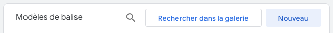
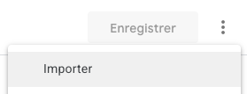
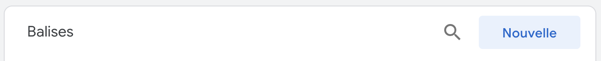

import { Image } from "astro:assets";
import { Aside, Badge, Steps } from "@astrojs/starlight/components";
import tagTypeImage from "../../../assets/hct/gtm-tag-select.png";
import addFieldImage1 from "../../../assets/hct/gtm-model-add-field-1.png";
import addFieldImage2 from "../../../assets/hct/gtm-model-add-field-2.png";
import addFieldImage3 from "../../../assets/hct/gtm-model-add-field-3.png";
import eventVariableImage from "../../../assets/hct/gtm-custom-event-variable.png";
import customTriggerImage from "../../../assets/hct/gtm-custom-trigger.png";

<Badge text="Google Tag Manager" size="large" />
<Badge text="JavaScript" size="large" />
\
Ce guide est applicable si vous souhaitez installer HCT avec un conteneur Google Tag Manager (GTM) 
de type web (client-side).

<Aside title="Prérequis">
  Avant de commencer, vous devez être en possession des éléments suivants :

  - Le template de balise HCT pour GTM (fichier .tpl)
  - Votre code de tracking HCT
  - Votre token HCT (si différent du token par défaut préconfiguré dans le modèle)

  Ces éléments vous sont fournis par Net Hélium.
</Aside>

## Import du modèle de balise HCT

Un modèle de balise est un template à partir duquel une balise GTM peut être créée.\
Commencez par importer le modèle de balise HCT en suivant les étapes suivantes :

<Steps>
  1.  Sélectionnez **`Modèles`** dans le menu de gauche de votre conteneur GTM et cliquez sur le 
      bouton **`Nouveau`** de l'encadré **Modèles de balise** :

      

  2.  Choisissez l'option **`Importer`** dans le menu contextuel accessible au clic sur le bouton 
      avec les trois points verticaux en haut à droite :

      

      Sélectionnez le template fourni (fichier .tpl) et validez.
</Steps>

<Aside>
  Si vous utilisez un sous-domaine personnalisé pour HCT, il faut penser à le configurer comme 
  modèle de correspondance d'URL autorisé dans la rubrique **`Injecter des scripts`** de l'onglet 
  **`Autorisations`**.
</Aside>

## Création de la balise HCT

Une fois le modèle importé, vous pouvez maintenant créer et configurer la balise à partir de ce 
modèle :

<Steps>
  1.  Sélectionnez **`Balises`** dans le menu de gauche de votre conteneur GTM et cliquez sur le 
      bouton **`Nouvelle`** de l'encadré **Balises** :

      

  2.  Donnez un nom à votre balise (**Tracking HCT** par exemple)

  3.  Cliquez sur le bloc **`Configuration de la balise`** et sélectionnez le type **`HCT`** dans la 
      rubrique **`Personnalisée`** :

      <Image src={tagTypeImage} alt="Choix du type de balise" width={200} />
  
  4.  Renseignez votre code de tracking

  5.  Remplacez le token par celui qui vous a été fourni. Si vous n'en avez pas reçu, laissez celui 
      par défaut.

  6.  Par défaut, une session HCT dure 30 minutes maximum. Vous pouvez modifier cette valeur si vous
      le souhaitez.

  7.  Par défaut, un événement `page_view` sera automatiquement envoyé sur HCT pour chaque page de 
      votre site. Vous pouvez désactiver ce comportement.
  
  8.  Lors de l'envoi d'un événement, les données de tracking sont envoyées sur HCT. Vous pouvez 
      activer une remontée automatique de ces données dans la session HCT même si aucun événement
      n'est déclenché.

  9.  Vous avez la possibilité d'activer la remontée automatique des données de formulaires. Un 
      événement `form_submit` sera ainsi envoyé sur HCT avec les données associées à la soumission
      d'un formulaire.

        <Aside type="caution">
          Cette option ne fonctionne que si les conditions suivantes sont réunies :
          - La soumission du formulaire est réalisée nativement (pas en **AJAX** ou autres 
            mécanismes personnalisés)
          - Le formulaire se trouve directement dans le **DOM** de la page (pas dans une `<iframe>`)
          - Seuls les champs ayant un attribut `name` seront envoyés.
        </Aside>
</Steps>

La balise HCT devrait être déclenchée si la récupération de données anonymes à des fins de 
statistiques est autorisée par l'utilisateur. Nous recommandons fortement l'utilisation du
<a
  href="https://support.google.com/tagmanager/answer/10718549?hl=fr" 
  target="_blank"
>mode consentement de GTM</a>
avec l'intégration d'une plate-forme de gestion du consentement (CMP). Un grand nombre de
<a
  href="https://cmppartnerprogram.withgoogle.com/intl/fr/" 
  target="_blank"
>CMP partenaires de Google</a>
existent pour facilement gérer le déclenchement de vos balises en fonction des préférences cookies 
de vos utilisateurs.

Reportez-vous à la documentation de votre CMP pour la mise en place d'un déclencheur adéquat.

## Fonctions HCT

Une fois déclenchée, la balise GTM injectera un script qui ajoutera une nouvelle propriété **`hct`** 
dans l'objet **`window`** de votre page. À partir de cette propriété, vous avez accès aux fonctions 
suivantes :

### hct.activate()

L'appel de cette fonction permet d'indiquer à HCT que l'utilisateur a donné son consentement pour 
que les données personnelles envoyées sur le serveur HCT permettant de l'identifier soient stockées 
et associées à ses sessions HCT. Les données concernées sont celles qui se trouvent dans la requête 
de la page du site qui envoi les données (adresse IP, données de tracking dans l'url, etc...).

Cette fonction peut optionnellement prendre en paramètre le timestamp du consentement qui est une 
valeur similaire à ce qui est renvoyé par **`Date.now()`**.

### hct.deactivate()

L'appel de cette fonction permet d'annuler le consentement sur la récupération des données 
permettant d'identifier l'utilisateur. HCT repassera en mode de récupération anonyme comme avant
l'appel de la fonction `activate()`.

### hct.associate()

Cette fonction permet d'associer un utilisateur à la session HCT en cours. Si votre site permet à 
vos utilisateurs de se connecter (espace client par exemple), vous pouvez utiliser cette fonction 
pour faire remonter les informations de l'utilisateur sur HCT une fois qu'il est connecté sur son 
compte.

<Aside type="caution">
  Vous devez vous assurer que l'utilisateur a donné son consentement pour autoriser l'utilisation 
  de ses données personnelles avant d'appeler cette fonction (même consentement que pour l'appel de 
  la fonction `activate()`). En effet, l'association aura lieu même si HCT est en mode anonyme.
</Aside>

Cette fonction prend en paramètre dans l'ordre :

- Le type d'association (chaîne de caractères). Actuellement, seul le type **login** est disponible.
- Les données de l'utilisateur (objet) avec les informations suivantes (toutes les données sont 
facultatives donc renseignez ce que vous pouvez) :
  - Un ou plusieurs identifiants (`id`, `id_2`, `id_3`, `id_4`, `id_5`)
  - Un prénom (`first_name`)
  - Un nom (`last_name`)
  - Un email (`email`)
  - Un téléphone (`phone`)

Exemple :

```js
hct.associate("login", {
  id: "123456",
  first_name: "Jean",
  last_name: "Dupont",
  email: "user@gmail.com",
});
```

### hct.send_event()

Cette fonction permet d'envoyer un événement personnalisé sur HCT ainsi que les données associées à 
cet événement.

Cette fonction prend en paramètres dans l'ordre :

- Le nom de l'événement HCT (chaîne de caractères)
- Les données associées à cet événement (objet)

Exemple :

```js
hct.send_event("add_to_cart", {
  product_id: "654321",
  price: 79.99,
});
```

## Centralisation des appels HCT sur GTM

Bien que les fonctions HCT puissent être appelées directement dans des scripts sur votre site, il 
est possible de centraliser ces appels dans la balise GTM en modifiant le modèle de la balise.

Pour cela, vous pouvez ajouter un nouveau champ qui contiendra le nom de l'événement responsable du 
déclenchement de la balise :

<Steps>
  1.  Cliquez sur **`Ajouter un champ`** dans l'onglet **`Champs`** :

      <Image src={addFieldImage1} alt="Ajout de champ" width={300} />

  2.  Choisissez le type **`Saisis de texte`** :

      <Image src={addFieldImage2} alt="Choix du type" width={400} />

  3.  Donnez un identifiant et un nom à ce champ (notre identifiant dans cet exemple est 
      `hctEvent`) :

      <Image src={addFieldImage3} alt="Nommage du champ" width={200} />
</Steps>

Revenez dans la configuration de la balise et renseignez la valeur de ce nouveau champ en utilisant 
la variable GTM intégrée **`Événement personnalisé`** (cliquez sur l'icône à la droite du champ pour
sélectionner cette variable :

<Image src={eventVariableImage} alt="Variable d'événement personnalisé" width={500} />

Cette variable contiendra le nom de l'événement correspondant au déclencheur ayant activé la balise.
Il vous reste à créer des déclencheurs personnalisés comme ceci :

<Image src={customTriggerImage} alt="Déclencheur personnalisé" width={600} />

La plupart des CMP vous permettent d'avoir accès à vos consentements via une variable GTM, 
reportez-vous à la documentation de votre CMP pour voir comment mettre en place des déclencheurs 
personnalisés utilisant les consentements.

Vous pouvez maintenant revenir dans la configuration du modèle et modifier le code de la balise pour
utiliser ces déclencheurs et ainsi exécuter le code spécifique HCT correspondant.

Exemple de modification du code à compléter selon vos besoins (onglet **Code** dans le modèle) :

```js
// Import du module permettant de récupérer le timestamp actuel
const getTimestampMillis = require("getTimestampMillis");

/**
 * Ajout d'une nouvelle fonction permettant d'exécuter les fonctions HCT en fonction de déclencheurs
 * personnalisés conditionnés sur vos consentements et/ou autres paramètres.
 */
const handleEvent = (event) => {
  switch (event) {
    /**
     * `marketing_consent_enabled` est un exemple de nom d'événement personnalisé qui se déclenche
     * lorsque l'utilisateur donne son consentement anonyme + infos personnelles (typiquement 
     * `statistiques` et `marketing`).
     */
    case "marketing_consent_enabled":
      // Appel de hct.activate() depuis la `window` avec le timestamp actuel passé en paramètre
      callInWindow("hct.activate", getTimestampMillis());
      break;
    /**
     * `marketing_consent_enabled` est un exemple de nom d'événement personnalisé qui se déclenche
     * lorsque l'utilisateur retire son consentement sur les infos personnelles (`marketing`) mais 
     * garde le consentement sur les données anonymes.
     */
    case "marketing_consent_disabled":
      // Appel de hct.deactivate() depuis la `window`
      callInWindow("hct.deactivate");
      break;
    
    /**
     * Autres `case` à ajouter pour les appels des fonctions `hct.associate` et `hct.send_event`
     * en fonction des actions possibles sur votre site. Pour la récupération des données à 
     * renseigner en paramètre de ces fonctions, vous pouvez par exemple les stocker dans un cookie 
     * ou dans le local storage.
     * 
     * Google met à disposition des modules permettant d'accéder à ces informations dans le code de 
     * la balise GTM (regardez les fonctions `getCookieValues` et `localStorage`).
     */
  }
};

const handleHCTScriptLoad = () => {
  // ...code existant qui initialise HCT si ce n'est pas encore fait

  /**
   * Ajoutez cette ligne avant `data.gtmOnSuccess();` pour exécuter la nouvelle fonction (remplacez 
   * `hctEvent` par l'identifiant que vous avez donné au champ contenant le nom de l'événement).
   */
  handleEvent(data.hctEvent);
};
```
